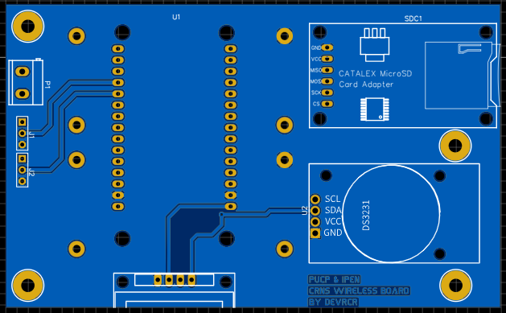

# Placa de Circuito Impreso (PCB)

Esta imagen muestra el diseño de la placa de circuito impreso (PCB) utilizada en el proyecto. La PCB contiene los componentes electrónicos necesarios para el sistema de registro y monitoreo de detectores. Proporciona una disposición física de los componentes y las conexiones entre ellos.
